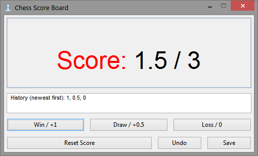

## What's this project?

This is an application for counting points while playing chess session.

Inspired by [chess videos](https://www.youtube.com/channel/UC6hOVYvNn79Sl1Fc1vx2mYA) of John Bartholomew.

Whenever the game ends, just hit one of the result buttons, proper points amount will be added to your score.

Application displays your overall score, game count and session's result history.

You can save scores in plain text file in order to keep tracking your progress.

## Technical touch

Application is written in C++ and uses [wxWidgets 3](https://www.wxwidgets.org/) library.

GUI layout was designed in [wxFormBuilder](https://github.com/wxFormBuilder/wxFormBuilder).

Project based on [CMake](https://cmake.org/) ([CLion](https://www.jetbrains.com/clion/)).

Should be multiplatform, but was tested only under Linux Mint 18 KDE, Windows 7 and Windows 10.

I've used icon from [icons8](https://icons8.com/) - check this out, the site is amazing! :)

## How to get application

For Windows platform there is prepared build in [windows-build](./windows-build) directory.
